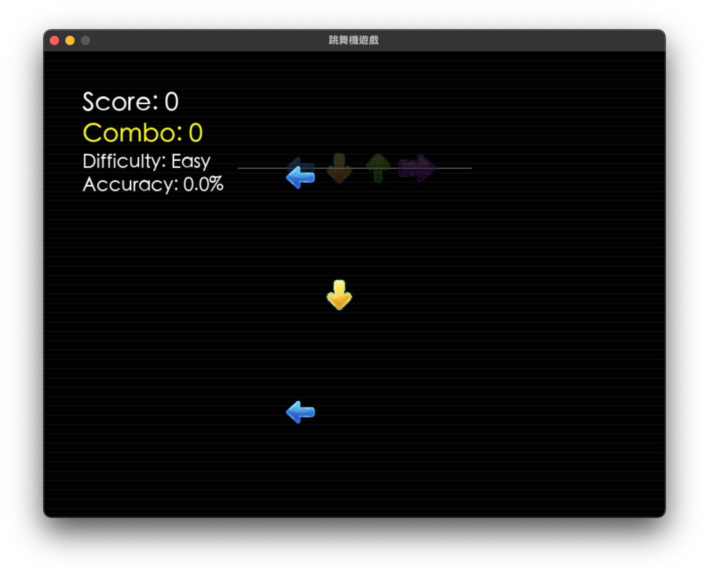

# 跳舞機遊戲

一款適合初學者的跳舞機遊戲，復古像素風格，支援跨平台。




## 功能特色

- 🎮 **簡單直觀的操作**: 使用方向鍵擊中向上移動的箭頭
- 🎯 **三級判定系統**: Perfect/Good/Miss 精準判定
- 📊 **完整計分系統**: 連擊、準確率、詳細統計
- 🎚️ **兩級難度**: 簡單模式適合新手，普通模式提供挑戰
- ⏸️ **遊戲控制**: 暫停、重新開始等完整功能
- 🎨 **像素風格**: 經典復古視覺效果
- 🔊 **音效支援**: 判定回饋音效（可選）

## 系統需求

- Python 3.11+
- pygame 2.6.1+
- 跨平台支援 (Windows/Mac/Linux)

## 安裝與執行

### 使用 uv (推薦)

```bash
# 克隆專案
git clone <repository-url>
cd dance-game

# 安裝依賴
uv install

# 執行遊戲
uv run python src/game/main.py
```

### 使用 pip

```bash
# 安裝依賴
pip install pygame

# 執行遊戲
python src/game/main.py
```

## 遊戲操作

### 主選單
- **1**: 開始簡單模式
- **2**: 開始普通模式  
- **ESC**: 退出遊戲

### 遊戲中
- **方向鍵**: 擊中對應方向的箭頭
  - ← 左箭頭 (紅色)
  - ↓ 下箭頭 (綠色)
  - ↑ 上箭頭 (藍色)
  - → 右箭頭 (黃色)
- **ESC**: 暫停遊戲

### 暫停狀態
- **ESC**: 繼續遊戲
- **Q**: 返回主選單

### 遊戲結束
- **ENTER**: 重新開始
- **ESC**: 返回主選單

## 計分規則

| 判定 | 分數 | 時機窗口 |
|-------|-------|----------|
| Perfect | 100 | ±20像素 |
| Good | 50 | ±40像素 |
| Miss | 0 | 超出±40像素 |

### 連擊獎勵
- 每達到10連擊獎勵50分
- 普通模式分數倍率1.2倍

## 難度差異

| 項目 | 簡單模式 | 普通模式 |
|-------|-----------|-----------|
| 箭頭速度 | 100像素/秒 | 150像素/秒 |
| 生成間隔 | 1.5秒 | 1.0秒 |
| 分數倍率 | 1.0x | 1.2x |

## 專案結構

```
dance-game/
├── pyproject.toml          # uv 專案配置
├── README.md               # 專案說明
├── src/
│   ├── game/              # 核心遊戲邏輯
│   │   ├── __init__.py
│   │   ├── main.py        # 遊戲入口
│   │   ├── engine.py      # 遊戲引擎主類
│   │   ├── arrow.py       # 箭頭物件類
│   │   ├── timing.py      # 時機判定系統
│   │   ├── score.py       # 計分系統
│   │   ├── difficulty.py  # 難度管理
│   │   └── constants.py   # 遊戲常數
│   ├── utils/             # 工具函數
│   │   ├── __init__.py
│   │   ├── asset_loader.py # 資源載入器
│   │   └── config.py      # 配置管理
│   └── assets/           # 資源檔案
│       ├── images/        # 像素風格圖像
│       ├── sounds/        # 音效檔案
│       └── fonts/         # 像素字體
├── tests/               # 測試檔案
└── scripts/             # 建置腳本
```

## 開發與測試

### 執行測試

```bash
# 使用 uv
uv run pytest tests/

# 使用 pip
python -m pytest tests/
```

### 代碼品質

遵循 PEP 8 程式碼規範：
- 使用 Type Hinting
- 完整的單元測試覆蓋
- 模組化設計架構
- 詳細的中文註解

## 技術特色

- **模組化架構**: 清晰分離遊戲邏輯、資源管理、配置系統
- **時機判定系統**: 精準的像素級判定演算法
- **資源快取**: 高效的資源載入和記憶體管理
- **配置系統**: 靈活的JSON配置檔案支援
- **跨平台相容**: 支援Windows、Mac、Linux

## 授權條款

本專案使用 MIT 授權條款。詳見 LICENSE 檔案。

## 貢獻指南

歡迎提交 Issue 和 Pull Request！

1. Fork 本專案
2. 建立功能分支 (`git checkout -b feature/AmazingFeature`)
3. 提交變更 (`git commit -m 'Add some AmazingFeature'`)
4. 推送到分支 (`git push origin feature/AmazingFeature`)
5. 開啟 Pull Request

## 更新日誌

### v1.0.0
- ✅ 基礎遊戲機制
- ✅ 完整判定系統
- ✅ 計分與連擊系統
- ✅ 兩級難度模式
- ✅ 選單與遊戲狀態管理
- ✅ 完整測試覆蓋

---

**享受遊戲的樂趣！** 🎮